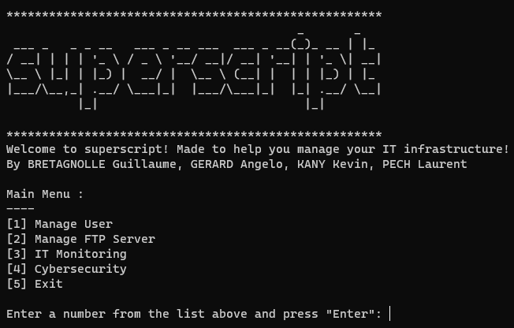

<p align="center">
  
</p>

# Python Project - Team Netway
This project's goal is to help the company's technicians managing the IT infrastructure.
The best way to do that is by making a collection of utilities in a single script that we call "superscript".

## Screenshot


## Features / To-do list
- [ ] Manage users (create, manage and list users/admins; manage passwords)
- [ ] Manage FTP (store files on server; daily backups)
- [x] IT Monitoring (daily port scanning)
- [ ] Cybersecurity (brute force attacks simulations)
- [x] Navigation menu (CLI UI to select a feature to use)

## Installation
Please make sure you have the following prerequisites:

- [Git](https://git-scm.com/downloads)
- [Python 3](https://www.python.org/downloads/)

### Downloading the source code
Clone the repository:

```shell
git clone https://github.com/AngeIo/projet_python_netway
cd projet_python_netway
```

To update the source code to the latest commit, run the following command inside the `projet_python_netway` directory:

```shell
git pull
```

## Usage
```shell
cd superscript/
./superscript
```

## License
The source code for "superscript" is [Public Domain](LICENSE).

## Authors
* BRETAGNOLLE Guillaume
* GERARD Angelo
* KANY Kevin
* PECH Laurent
